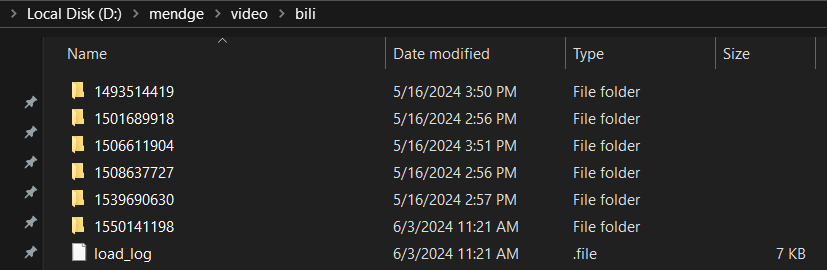
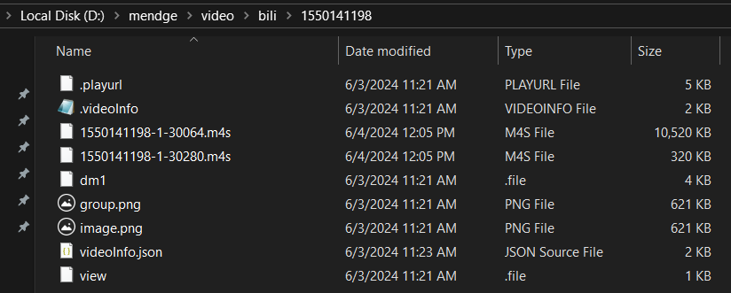

## 介绍
之前获取b站原画质视频的方法是使用win10应用商店的【哔哩uwp】进行下载。
下载的文件格式是.mp4，但是播放器无法正常解码播放。
需要删除视频文件二进制数据前9bit数据，才能被正常播放。

但是现在b站推出了自己的windows客户端，不再对哔哩uwp提供登录功能。
我现在摸索出的方案是：使用新的windows官方客户端先对视频进行缓存，然后再使用脚本将其转为mp4格式。
脚本所做的工作：恢复.m4s文件的格式，合并.m4s音频视频为.mp4文件。
此过程中不会损失画质，除非你从客户端缓存的时候选择的画质就比较低。

从客户端缓存视频后，视频会被下载到你指定的目录`D://mendge//video//bili`（如下图）。
每一个数字串目录对应一个缓存视频，数字串对应的视频信息可以在`load_log`中查看。



每一个数字串目录的子文件如下图，其中`.videoInfo`以json形式记录视频的详细信息。 前一个m4s文件是视频文件，后一个m4s文件是音频文件。



## 示例
右边 release 手动下载 bgen.exe 可执行命令（或者自己源码编译生成），进入终端并且 cd 到 bgen.exe 所在目录。
命令实现对单视频的处理和多视频的批处理，命令示例中尖括号对应的参数需要根据你自己的目录来填写：

【单视频处理：`./bgen.exe <srcdir> <destdir>`】

根据上面图片,`srcdir`就应该是`D://mendge//video//bili//1550140098`,`destdir`是目的.mp4文件的输出路径，由自己指定。

【多视频批处理：`./bgen.exe <srcdir> <destdir> --batch`】

根据上面图片我的`srcdir`就应该是`D://mendge//video//bili`

## 贡献
```shell
    git clone https://github.com/mendge/bgen.git
    cd bgen
    make prepare
```
然后就能进行二次开发了
